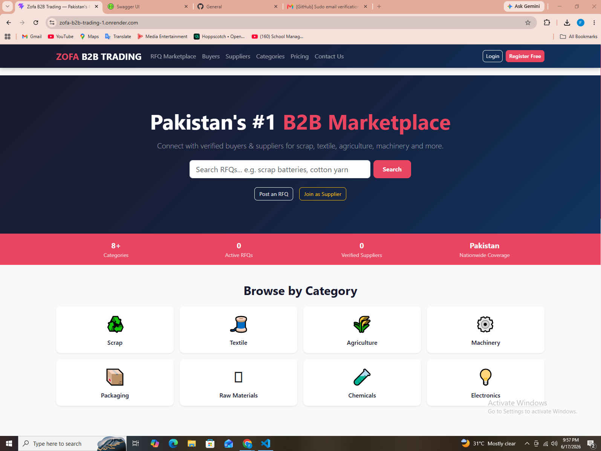
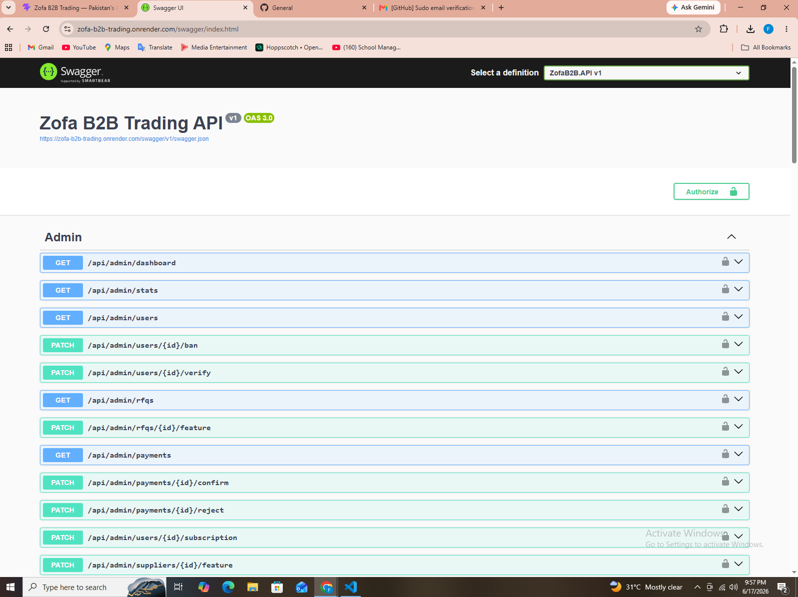
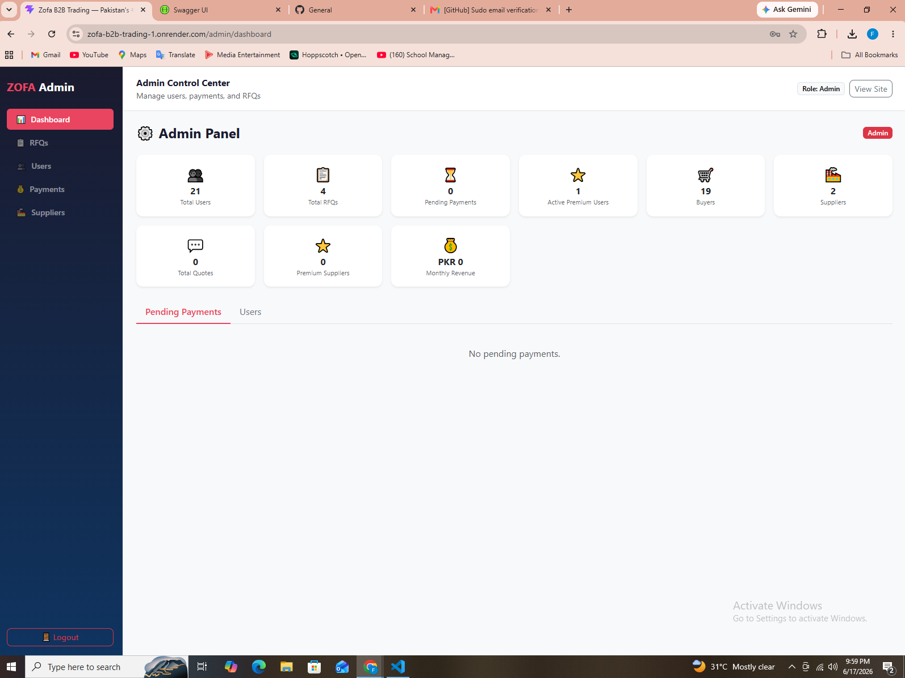

# 🏢 Zofa B2B Trading Platform

Pakistan's B2B Marketplace — connecting buyers and suppliers for industrial goods.

## 🌐 Live Demo
- **Frontend:** [https://zofa-b2b-trading-1.onrender.com](https://zofa-b2b-trading-1.onrender.com)
- **Backend API:** [https://zofa-b2b-trading.onrender.com](https://zofa-b2b-trading.onrender.com)
- **API Docs:** [https://zofa-b2b-trading.onrender.com/swagger](https://zofa-b2b-trading.onrender.com/swagger)

---

## ✨ Key Features

- 🔐 **JWT Authentication** with email verification
- 📋 **RFQ System** — Buyers post requests, suppliers send quotations
- 💬 **Real-time Messaging** between buyers and suppliers
- 📊 **Admin Dashboard** with analytics and user management
- 💰 **Monetization** — Premium subscriptions, lead unlocks, featured listings
- 📱 **Fully Responsive** mobile-first design
- 🔔 **Notification System** with real-time bell icon

---

## 🛠 Tech Stack

| Layer | Technology |
|-------|-----------|
| **Frontend** | React 18 + Vite + Bootstrap 5 |
| **Backend** | ASP.NET Core 8 Web API |
| **Database** | PostgreSQL (Supabase) |
| **Auth** | JWT Bearer Tokens |
| **Hosting** | Render (Cloud) |
| **Email** | Resend / SMTP / EmailJS |

---

## 📸 Screenshots

| Page | Preview |
|------|---------|
| **Home** |  |
| **Admin** |  |
| **API Docs** |  |

---

## 🚀 My Role

**Full Stack Developer** — Designed and developed the entire application from scratch:
- Built RESTful API with .NET Core and Entity Framework
- Implemented JWT authentication and role-based access control
- Created responsive React frontend with Bootstrap 5
- Deployed on Render with CI/CD pipeline
- Integrated multiple email providers for verification

---

## 🏗 Project Structure

ZofaB2B.API/
├── Controllers/
├── Models/
├── DTOs/
├── Data/
├── Services/
└── Helpers/

zofa-frontend/
└── src/
├── pages/
├── components/
├── context/
└── api.js

## 💻 Local Setup

### Prerequisites
- .NET 8 SDK
- PostgreSQL (or Supabase)
- Node.js 18+

### Backend
```bash
cd ZofaB2B.API
dotnet run
API: http://localhost:5000
Swagger: http://localhost:5000/swagger
Frontend
bash
cd zofa-frontend
npm install
npm run dev
App: http://localhost:3000
📊 Monetization
Table
Revenue Stream	Price (PKR)
Premium Monthly	2,500/month
Premium Yearly	20,000/year
Lead Unlock	200/lead
Featured RFQ	500/7 days
Featured Supplier	1,500/month
🔑 Default Credentials
Table
Role	Email	Password
Admin	admin@zofa.pk	Admin@123

## 📞 Contact

- Email: faizanktk2006@gmail.com  
- LinkedIn: https://www.linkedin.com/in/faizan-khan-9b8739324 
